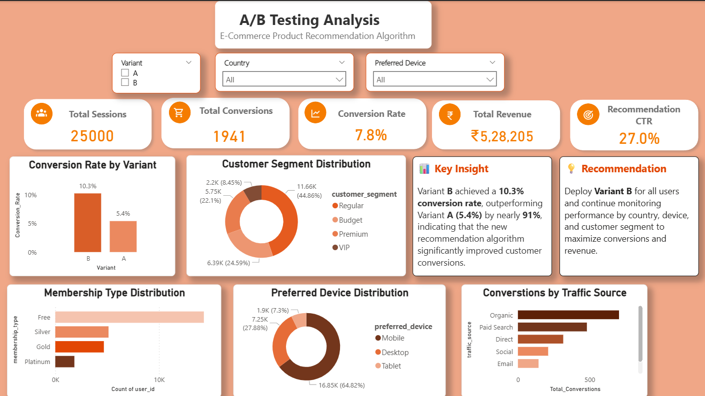

📊 A/B Test Experiment Analysis Dashboard

📌 Overview
This project analyzes an A/B test conducted for an e-commerce product recommendation algorithm to determine whether the new recommendation model (Variant B) outperformed the existing model (Variant A). The analysis combines Python, SQL, statistical testing, and Power BI to deliver data-driven business insights through an interactive dashboard.

🎯 Objective
- Compare Variant A and Variant B performance.
- Measure conversion rate, revenue, and CTR.
- Analyze customer segments and traffic sources.
- Recommend the best-performing variant.

🛠️ Tech Stack
Python
Pandas
NumPy
SciPy
SQLite
SQL
Power BI
DAX
Matplotlib

📂 Dataset
The project uses two datasets:
-> ab_test_results.csv – Experiment and session-level data
-> users.csv – Customer demographics and segmentation

📊 Dashboard Features

KPI Cards
- Total Sessions
- Total Conversions
- Conversion Rate
- Total Revenue
- Recommendation CTR
 
Interactive Visualizations
- Conversion Rate by Variant
- Customer Segment Distribution
- Membership Type Distribution
- Preferred Device Distribution
- Conversions by Traffic Source

Dynamic Filters
- Variant
- Country
- Preferred Device

📈 Key Insights
- Variant B achieved a 10.3% conversion rate, outperforming Variant A (5.4%).
- Overall conversion rate reached 7.8%.
- Recommendation CTR was 27%.
- Organic traffic generated the highest conversions.
- Mobile users represented the largest customer group.

💡 Business Recommendation
Deploy Variant B as the primary recommendation algorithm and continue optimizing campaigns using customer segmentation and traffic source insights to maximize conversions and revenue.

📷 Dashboard Preview

📁 Repository Structure
A-B-Test-Experiment-Analysis/
│
├── data/
├── notebooks/
├── sql/
├── images/
├── visuals/
├── ab_test_analysis.db
└── requirements.txt

👩‍💻 Author
Priyanka K
Skills: Python • SQL • Power BI • Pandas • SciPy • Data Analytics • Data Visualization
